# a11y GitHub App + Actions — Architecture

## Full Flow

| Step | Lives in | Action |
|------|----------|--------|
| 1 | GitHub | Developer comments `/a11y` on a PR |
| 2 | GitHub App + Actions | Detects the comment, extracts repo, branch, PR number, commit SHA |
| 3 | GitHub App + Actions | Acknowledges command with a pending comment on PR & queues job async |
| 4 | GitHub App + Actions | Clones repo, installs dependencies, starts app & waits for localhost:3000 |
| 5 | GitHub App + Actions → Claude Code Server | Sends audit job: `{ localPath, baseUrl }` |
| 6 | Claude Code Server | Runs a11y skill → generates remediation.md |
| 7 | Claude Code Server → GitHub App + Actions | Returns `{ jobId, findings }` |
| 8 | GitHub App + Actions | Updates PR comment with issue list |
| 9 | GitHub | Reviewer replies with a fix command (e.g. `/a11y fix A1 A3`, `/a11y fix safe-only`) |
| 10 | GitHub App + Actions | Detects fix command & resolves which issues to fix |
| 11 | GitHub App + Actions → Claude Code Server | Sends fix job: `{ jobId, fixes: [A1, A3] }` |
| 12 | Claude Code Server | Runs a11y skill, applies approved fixes & re-scans to verify |
| 13 | Claude Code Server → GitHub App + Actions | Returns `{ summary, changedFiles }` |
| 14 | GitHub App + Actions | Commits changes, pushes to new branch, opens fix PR |
| 15 | GitHub App + Actions | Posts final comment in original PR |

---

## Supported Commands

| Command | Action |
|---------|--------|
| `/a11y` | Run audit and post findings |
| `/a11y fix A1 A3` | Apply specific fixes by ID |
| `/a11y fix safe-only` | Apply all structural fixes |
| `/a11y ignore A2` | Exclude an issue from the fix queue |
| `/a11y cancel` | Cancel the current job and run cleanup |

---

## Issue Classification

| Type | Examples | Action |
|------|----------|--------|
| Safe | Missing form label, icon button without name, ARIA | Auto-applicable — goes in fix PR |
| Review | Color contrast, font-size, focus styles | Suggested only — comment in PR |

---

### 1. Scan Flow

```mermaid
%%{init: { 'theme': 'base', 'themeVariables': { 'primaryColor': '#3b5cd9', 'primaryTextColor': '#1e293b', 'primaryBorderColor': '#1e308a', 'lineColor': '#64748b', 'secondaryColor': '#f1f5f9', 'tertiaryColor': '#fff', 'mainBkg': '#fff', 'nodeBorder': '#e2e8f0', 'clusterBkg': '#f8fafc', 'clusterBorder': '#cbd5e1' } } }%%
flowchart LR
    A["<b>Developer</b><br/>comments /a11y on a PR"]
    B["<b>GitHub App + Actions</b><br/>Run axe + Playwright"]
    C["<b>Claude Code Server</b><br/>Runs a11y skill"]
    D["<b>GitHub App + Actions</b><br/>Post issue list on PR"]

    A --> B --> C --> D

    linkStyle default stroke:#64748b,stroke-width:2px;
    classDef default font-family:Inter,sans-serif,font-size:14px,min-width:200px;
    classDef dev fill:#f0fdf4,stroke:#86efac,color:#166534;
    classDef app fill:#eff6ff,stroke:#93c5fd,color:#1e3a8a;
    classDef srv fill:#3b5cd9,color:#fff,stroke:#1e308a,stroke-width:2px;

    class A dev;
    class B,D app;
    class C srv;
```



---

### 2. Fix Flow

```mermaid
%%{init: { 'theme': 'base', 'themeVariables': { 'primaryColor': '#3b5cd9', 'primaryTextColor': '#1e293b', 'primaryBorderColor': '#1e308a', 'lineColor': '#64748b', 'secondaryColor': '#f1f5f9', 'tertiaryColor': '#fff', 'mainBkg': '#fff', 'nodeBorder': '#e2e8f0', 'clusterBkg': '#f8fafc', 'clusterBorder': '#cbd5e1' } } }%%
flowchart LR
    A["<b>Developer</b><br/>comments /a11y fix A1 A3"]
    B["<b>GitHub App + Actions</b><br/>Parse command · Send fix job"]
    C["<b>Claude Code Server</b><br/>Runs a11y skill"]
    D["<b>GitHub App + Actions</b><br/>Commit · Push · Open fix PR"]

    A --> B --> C --> D

    linkStyle default stroke:#64748b,stroke-width:2px;
    classDef default font-family:Inter,sans-serif,font-size:14px,min-width:200px;
    classDef dev fill:#f0fdf4,stroke:#86efac,color:#166534;
    classDef app fill:#eff6ff,stroke:#93c5fd,color:#1e3a8a;
    classDef srv fill:#3b5cd9,color:#fff,stroke:#1e308a,stroke-width:2px;

    class A dev;
    class B,D app;
    class C srv;
```



---

## Cleanup

The cloned repo and app process are kept alive after the fix PR is opened — the developer may issue further commands. Cleanup is triggered by:

| Trigger | Action |
|---------|--------|
| Fix PR merged or closed | Kill process, delete cloned repo |
| Developer runs `/a11y cancel` | Kill process, delete cloned repo |
| Inactivity timeout (e.g. 2h) | Kill process, delete cloned repo |

---

## Error States

| Failure point | Cause | Action |
|---------------|-------|--------|
| Step 4 | App fails to start or localhost:3000 never responds | Update PR comment with error, run cleanup |
| Step 6 | a11y skill audit fails | Update PR comment with error, run cleanup |
| Step 12 | a11y skill fix fails or re-scan finds regressions | Post error comment on PR, skip commit |

In all cases the original PR receives a comment explaining the failure. No partial changes are committed.

---

### PR Comment Format

```
## a11y Audit — 3 issues found

| ID | Issue | Severity | Type |
|----|-------|----------|------|
| A1 | Missing form label | Critical | safe |
| A2 | Modal missing accessible name | Serious | review |
| A3 | Icon button without name | Serious | safe |

**Reply with a command:**
- `/a11y fix A1 A3` — fix specific issues
- `/a11y fix safe-only` — fix all safe issues
- `/a11y ignore A2` — exclude an issue
```
